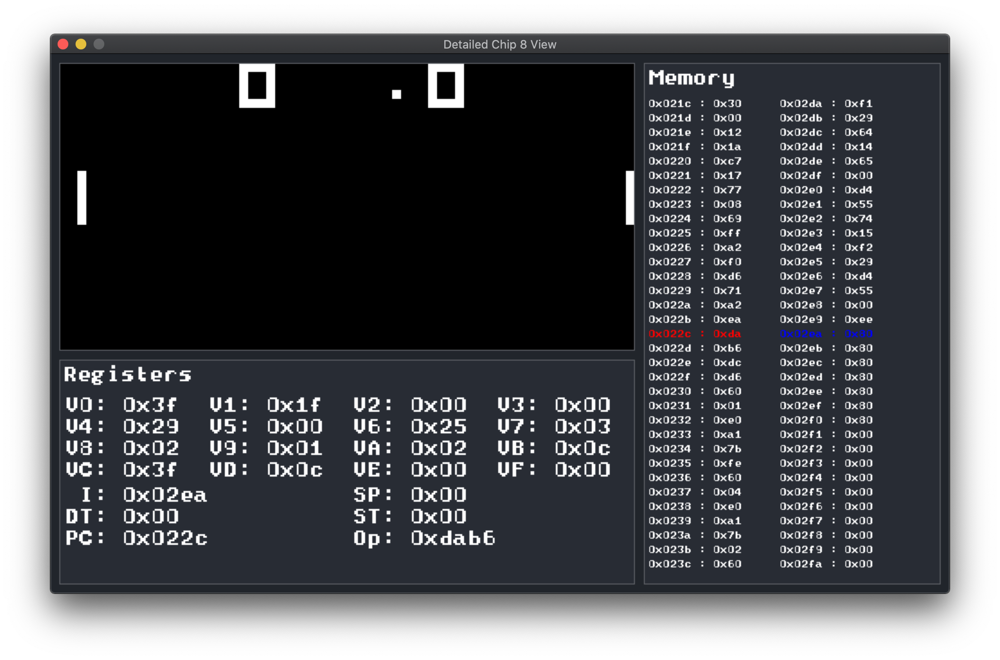
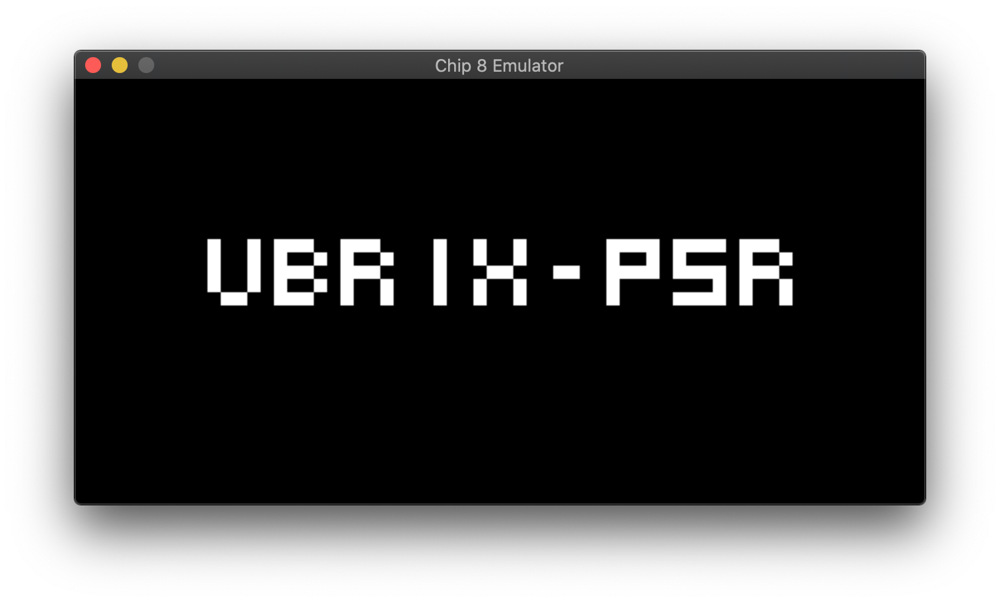
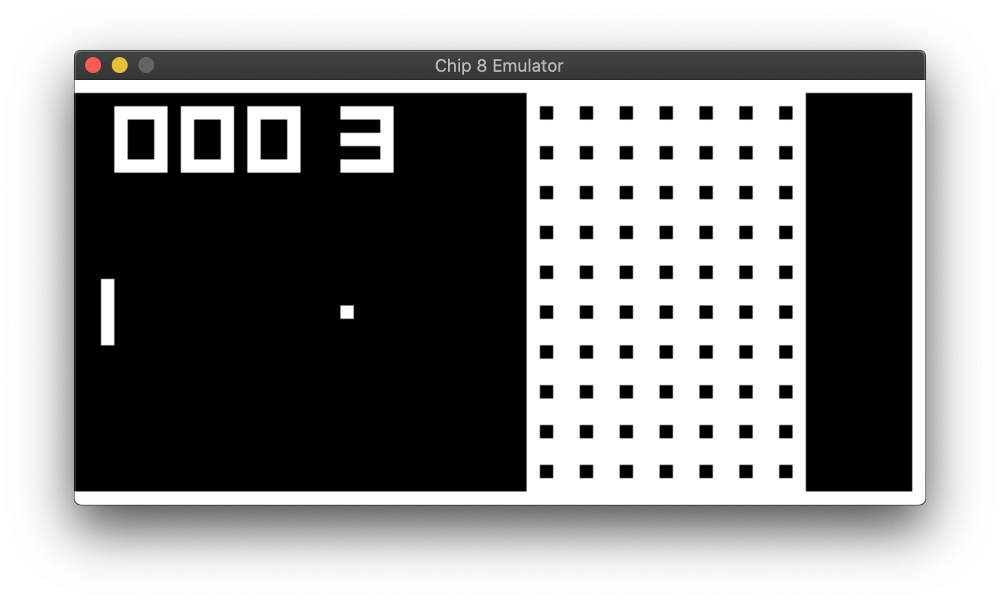
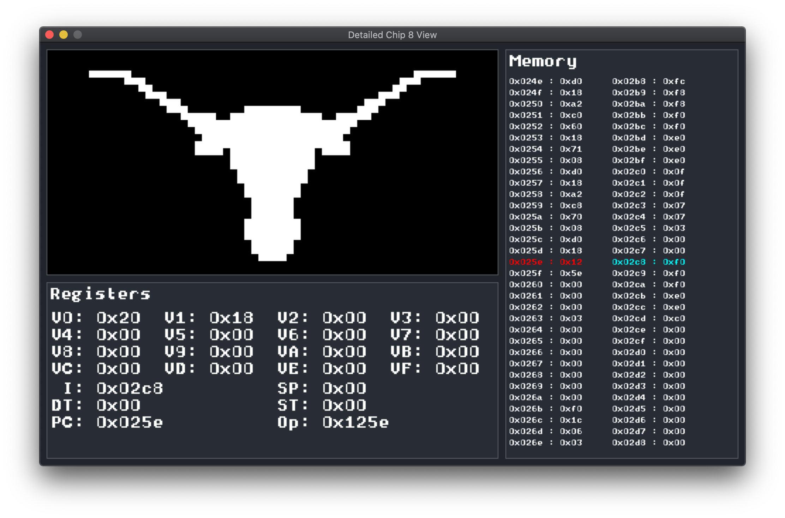
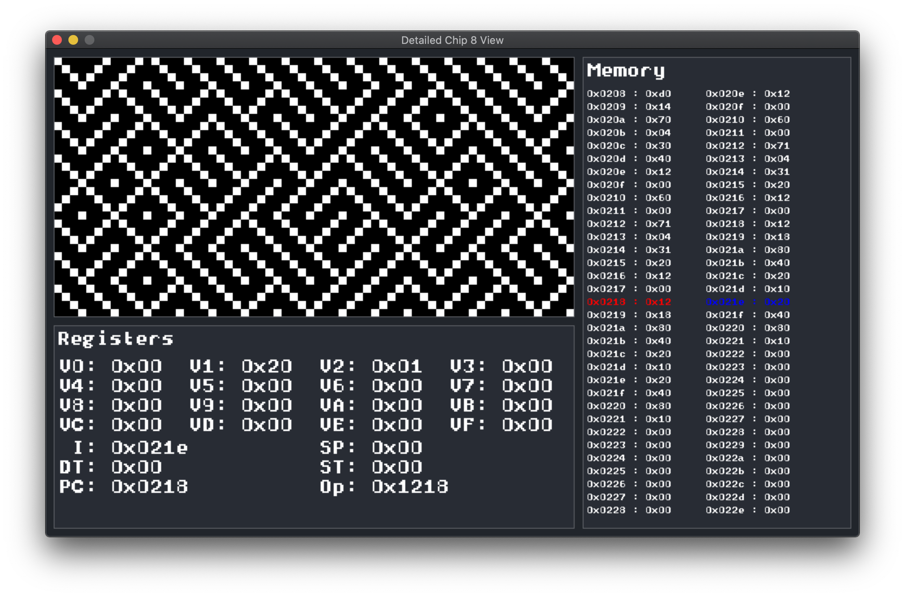

# Chip 8 Emulator/Interpreter

An emulator and interpreter for the Chip 8 system written in C++.



Graphics were done using the [SDL 2.0 library](https://www.libsdl.org).
Unit tests on the emulator written using [GoogleTest](https://github.com/google/googletest).

Currently, there are two GUI views available a simple and detailed view. 
The simple view only displays the graphics output by the Chip 8 emulator.

The detailed view includes the graphics output along with information about the Chip 8's registers and memory.
In the detailed view, the user can pause the program and step through each instruction one-by-one.

## Building

The following are instructions on how to build the Emulator and testing source code.

### Installing SDL 2.0
This emulator uses SDL 2.0 for graphics so that needs to be installed first.

#### MacOS

On MacOS using homebrew:

```
brew install sdl2
```

#### Linux

On Ubuntu/Debian:
```
sudo apt-get install libsdl2-dev
```

On Arch:
```
sudo pacman -S sdl2
```

### Emulator Executable

Once SDL is installed, clone this respository and enter the repository's root directory.
Run the following commands:
```
cmake .
make emulator
```
This will produce an executable named `emulator`. To run the included demo program, run:

```
./emulator LonghornDemo.ch8
```

To get a more detailed GUI, run:

```
./emulator -d LonghornDemo.ch8
```

Or, run `./emulator -h` for more usage information. 

There are more Chip 8 programs available [here](https://github.com/dmatlack/chip8/tree/master/roms/).


### Unit Tests Executable

To build the unit testing executable, run these commands instead:
```
cmake .
make tester
```
This will produce an executable named `tester`. It takes no command line arguments.

## Screenshots (Default, simple GUI)





## Screenshots (Detailed GUI)




## Attributions

The font sprite sheet used was created by user "Hobo" and was downloaded from [here](https://opengameart.org/content/monospace-bitmap-fonts-english-russian)

The Chip 8 Programs included in the screenshots and used during development (except for  `LonghornDemo.ch8`) were found [here](https://github.com/dmatlack/chip8/tree/master/roms).

The Octo Chip8 IDE made by John Earnest was extremely useful in creating `LonghornDemo.ch8`. It can be used [here](http://johnearnest.github.io/Octo/).

## References

[Cowgod's C8 Technical Reference](http://devernay.free.fr/hacks/chip8/C8TECH10.HTM#2.5)

[LazyFoo's SDL Reference](http://www.lazyfoo.net/tutorials/SDL/index.php)

